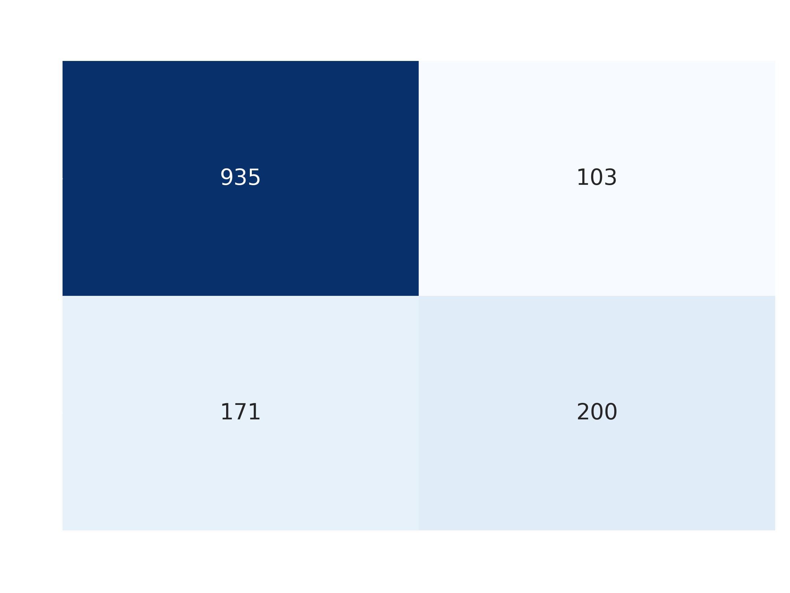

<p align="center">
  
</p>

# 📡 Proyecto MLOps: Predicción de Churn en Telecomunicaciones


## 🎯 ¿Qué hace este proyecto?

Este proyecto desarrolla un **sistema completo y colaborativo de predicción de abandono de clientes (Churn)** simulando un entorno laboral real. Implementa un pipeline de Machine Learning modular y reproducible que incluye:

- **Preprocesamiento automático** y entrenamiento de modelos.
- **Control de Versiones de Datos (DVC)** y **Tracking de Experimentos (MLflow)**.
- **Pruebas y Calidad de Código** en Integración Continua (CI) usando `pre-commit` y `pytest`.
- **Despliegue de API REST** mediante FastAPI, empaquetada con Docker para producción.

<p align="center">
  
</p>

---

## 🏆 Resultados del Modelo

**Algoritmo seleccionado:** `RandomForestClassifier`

| Métrica | Valor | Interpretación |
|---------|-------|----------------|
| **Accuracy** | 0.8155 | 81.55% de las predicciones globales son correctas. |
| **Recall** | 0.5389 | Identifica el 53.89% de los clientes que realmente abandonarán. |

> **Nota:** El Recall de 0.54 se debe al desbalance de clases (74% No Churn / 26% Churn) presente en los datos originales.

<p align="center">
  
  
</p>

---

## 📊 ¿Qué dataset usa y para qué sirve?

- **Dataset:** *Telco Customer Churn* (fuente original: Kaggle - IBM Sample Data).
- **Propósito:** Predecir si un cliente cancelará su servicio de telecomunicaciones (`Churn = Yes / No`), lo que permite a la empresa tomar medidas preventivas y accionar estrategias proactivas de retención.
- **Contenido:** 7,043 registros y 21 variables, abarcando información demográfica, servicios contratados y comportamiento financiero (ej. `tenure`, `MonthlyCharges`).
- *Nota: Un análisis profundo de las variables y sus implicaciones éticas y sesgos se documenta extensamente en `DATASET.md` y `ETHICS.md`.*

---

## 🚀 ¿Cómo lo instalo?

Para ejecutar este proyecto, es necesario instalar sus dependencias en un entorno aislado.

### Opción A: Instalación Local con Entorno Virtual
```bash
# 1. Clonar el repositorio
git clone https://github.com/RobbeAlex/churn-mlops-project.git
cd churn-mlops-project

# 2. Crear el entorno virtual
python -m venv .venv

# 3. Activar el entorno virtual
source .venv/bin/activate  # En Windows usar: .venv\Scripts\activate

# 4. Instalar todas las dependencias con sus versiones específicas
pip install -r requirements.txt

# 5. Configurar los hooks de calidad de código (opcional pero recomendado)
pre-commit install
```

### Opción B: Instalación con Docker (Alternativa recomendada)
```bash
git clone https://github.com/RobbeAlex/churn-mlops-project.git
cd churn-mlops-project
docker-compose build
```

---

## 🏃 ¿Cómo lo ejecuto?

El proyecto permite reproducir el entrenamiento mediante DVC y levantar una API REST de inferencia.

### 1. Ejecutar el Entrenamiento (Pipeline de ML)
Gracias a DVC, se puede reproducir el flujo completo (descarga de datos, preparación y entrenamiento) respetando estrictamente sus dependencias:
```bash
dvc repro
```
*(Para visualizar las métricas y parámetros, puedes levantar la interfaz de MLflow con el comando `mlflow ui`, disponible en http://127.0.0.1:5000).*

### 2. Levantar la API de Predicción
```bash
# De forma local usando Uvicorn:
uvicorn src.api:app --reload

# O usando contenedores con Docker Compose:
docker-compose up -d api
```

### 3. Ejemplo rápido de Inferencia (Uso)
Con la API levantada, puedes enviar una petición HTTP para predecir si un cliente hará Churn o no.

**Petición (`curl`):**
```bash
curl -X POST "http://127.0.0.1:8000/predict" \
     -H "Content-Type: application/json" \
     -d '{
           "tenure": 2, "MonthlyCharges": 70.5, "TotalCharges": 141.0, 
           "gender": 1, "Partner": 0, "Dependents": 0, "PhoneService": 1, 
           "MultipleLines": 0, "InternetService": 2, "OnlineSecurity": 0, 
           "OnlineBackup": 0, "DeviceProtection": 0, "TechSupport": 0, 
           "StreamingTV": 0, "StreamingMovies": 0, "Contract": 0, 
           "PaperlessBilling": 1, "PaymentMethod": 2, "SeniorCitizen": 0
         }'
```

**Salida esperada:**
```json
{
  "prediction": 1,
  "label": "Churn",
  "probability": 0.73
}
```

---

## 👥 Roles y Responsabilidades

El proyecto fue desarrollado simulando la dinámica de un equipo especializado colaborativo:

- **Data Engineer:** Responsable de `src/data_loader.py` para la carga, imputación, codificación de variables y división del dataset.
- **ML Engineer:** A cargo de `src/model_trainer.py`, gestionando el modelo, el cálculo de métricas (Accuracy, Recall) y el versionado con MLflow.
- **MLOps Engineer:** Responsable de la orquestación (`config/params.yaml`), configuración de rutas, pipeline de DVC y flujos de integración.
- **QA & Production Engineer:** Desarrolló las pruebas unitarias en `test/test_pipeline.py` y construyó el código de despliegue mediante la API en `src/api.py`.

---

## 🤖 Contribución de LLM (Inteligencia Artificial)

Se utilizaron modelos de lenguaje grandes (LLMs) como asistencia técnica para agilizar el desarrollo y la depuración del código:

- **Data Engineer:** Utilizó **Gemini** para optimizar la lógica de preprocesamiento, como la limpieza de espacios en blanco y la conversión a numérico en la columna `TotalCharges`.
- **ML Engineer:** Utilizó **Gemini** para estructurar la extracción del cálculo de métricas de desempeño y para revisar el proceso de guardado de los modelos utilizando `joblib`.
- **MLOps Engineer:** Utilizó **ChatGPT / Gemini** para la resolución de conflictos relacionados con rutas de archivos absolutas vs relativas (`os.path`) y para generar plantillas estructurales para `dvc.yaml`.
- **QA & Production Engineer:** Utilizó **Gemini** para bosquejar la estructura inicial de `pytest` (asserts y fixtures) y sugerir la lógica de captura de excepciones en FastAPI para la respuesta de la red en `predict.py`.
